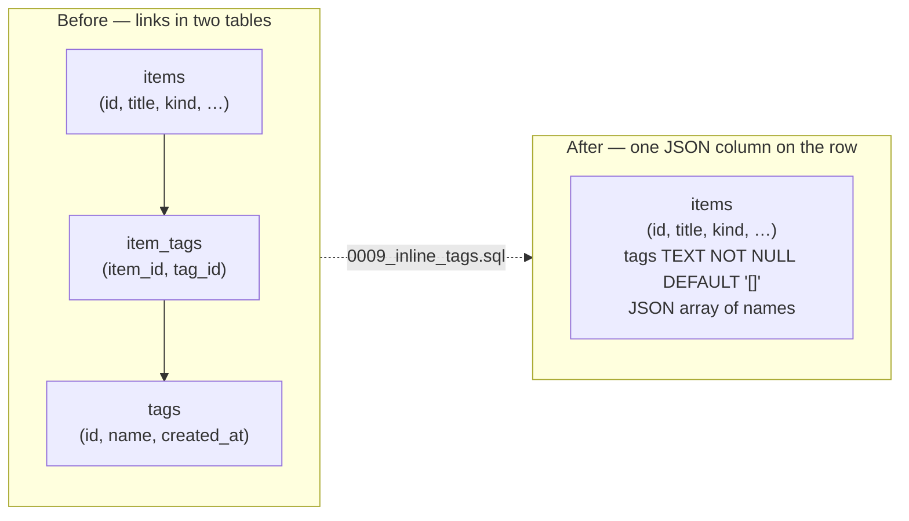
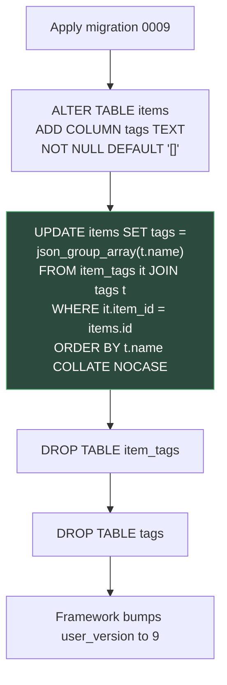

# Kivo T16 — Inline Note Tags

**Status: plan approved. Implementation running in parallel.**

This plan moves tags out of their own page and their own tables. Tags now live on each item row as a JSON array. The `/tags` page goes away. The tag sidebar, the item dialog TagPicker, and the All Items tag filter keep working from the same data.

## Objective and success criteria

Goal: store tags inline on items and remove the Tags page, with no change to how a person tags a note.

**Done when:**

- The `/tags` route, the `src/features/tags/TagsPage.tsx` component, and the sidebar **Tags** link are gone.
- The `tags` and `item_tags` tables are gone. Each item row holds its own tags in `items.tags`.
- Existing tag links are copied into the new column before the old tables are dropped. No tag data is lost.
- `list_tags` still works and returns `{ name, count }`, built from live items.
- `save_tag` and `delete_tag` are removed from the Rust command list and the frontend data layer.
- `set_item_tags` still replaces the note's tag array and logs an `updated` activity row.
- The All Items tag filter matches on tag name, not tag id.
- The item dialog TagPicker and the note sidebar still attach and remove tags.
- Vault summary still reports `tagCount`, counting distinct tag names on live items.
- `npm run typecheck`, `npx vitest run`, `cd src-tauri && cargo test`, and `npm run build` pass.

**Not in scope:** no new tag UI, no tag colors, no tag merging, no renames of existing tags, no change to untagging or to how tags render in lists. Existing users keep their tags as they are.

## Before / after storage

Old model: an item points at tag rows through the `item_tags` link table, so a tag name lives once and many items share it. New model: each item carries its own array of tag names. Names can repeat across items, which is what the old link table modelled.

## Migration flow — `0009_inline_tags.sql`

The backfill runs once per item. `json_group_array` builds the array from the ordered names, so an upgraded vault reads the same names it had before. Items with no links get the default `[]`. The column is added before the read and dropped after, so the copy can read the old tables.

## File map

### Backend

| File | Change | Detail |
| --- | --- | --- |
| `src-tauri/migrations/0009_inline_tags.sql` | Added | Add `items.tags`, backfill from `item_tags` + `tags`, drop both tables. |
| `src-tauri/src/database.rs` | Modified | Register migration 9. Read and write `items.tags`. Rewrite the tag Rust tests for the new store. |
| `src-tauri/src/vault.rs` | Modified | Read tags from the inline column. Derive `list_tags`. Replace tag filter by name. Rewrite `set_item_tags`. Remove `save_tag` and `delete_tag`. Count `tagCount` from live items. |
| `src-tauri/src/lib.rs` | Modified | Drop `save_tag` and `delete_tag` from the command list. Keep `list_tags` and `set_item_tags`. |

### Frontend

| File | Change | Detail |
| --- | --- | --- |
| `src/features/tags/TagsPage.tsx` | Deleted | The whole Tags page goes away. |
| `src/app/router.tsx` | Modified | Remove the `/tags` route. |
| `src/app/navigation.ts` | Modified | Remove the **Tags** link from the **LIBRARY** group. |
| `src/features/modules/ModulePage.tsx` | Modified | Remove the `tags` entry from `moduleRoutes`. |
| `src/data/tags.ts` | Modified | Keep `Tag` and `listTags`. Remove `saveTag` and `deleteTag`. |
| `src/data/items.ts` | Modified | `ItemFilter.tagId` becomes `ItemFilter.tag` (name). `setItemTags` still sends `{ id, tags }`. |
| `src/components/items/FilterMenu.tsx` | Modified | Filter keys use the tag name. Label and behavior stay. |
| `src/features/items/ItemsPage.tsx` | Modified | Reads `tag` from the URL and from the menu, passes the tag name in the item filter. |
| `src/components/items/dialogs.tsx` | Modified | `TagPicker` keeps its options from `listTags`, with no `saveTag` call. |
| `src/features/items/ItemDetailsDialog.tsx` | Modified | Sends the tag name list through `setItemTags`, no id lookups. |

## Data contract

### Inline format

- `items.tags` is `TEXT NOT NULL DEFAULT '[]'`.
- The value is a JSON array of strings, for example `["design","planning"]`.
- Order follows the stored array. The migration writes names sorted with `COLLATE NOCASE`.
- An item with no tags stores `[]`.

### Read rules

- `list_items` parses `items.tags` and returns `tags: string[]` on each item.
- A malformed value is read as an empty list, so one bad row never breaks a list.
- `list_tags` reads all live items, collects every name, and returns `{ name, count }`.
  - Live items only: rows with `deleted_at IS NULL`.
  - Case-insensitive dedupe: `Work` and `work` become one entry; the first spelling seen is kept.
  - `count` is how many live items use that name, under the same case-insensitive match.

### Write rules

- `set_item_tags(id, tags)` replaces the whole array for that item in one SQL `UPDATE`.
  - It writes the tags column, bumps `updated_at`, and inserts one `activity` row with action `updated`.
  - It returns the saved list so the UI can show exactly what was stored.
- No separate tag rows are created, renamed, or deleted. A tag exists while some item uses it.

### Filter semantics

- `ItemFilter.tag` holds a tag **name**, not an id.
- Filtering matches the item when its inline array contains that name, case-insensitively.
- `ItemFilter.tagId` is removed. Every caller moves to `ItemFilter.tag`.
- The All Items menu still shows **All tags** plus one entry per name from `list_tags`.

### Vault summary

- `tagCount` counts distinct tag names across live items, using the same case-insensitive dedupe as `list_tags`.
- The shapes of the vault summary and dashboard types do not change.

### New notes

- A draft note saves first, then the existing note sidebar attaches tags straight to that note.
- No new UI. The sidebar and TagPicker already call `setItemTags`.

## Parallel execution waves

Five agents run at once. Each owns its files, so the wave has no write collisions.

| Agent | Owns | Work |
| --- | --- | --- |
| 1 — Rust migration + DB tests | `src-tauri/migrations/0009_inline_tags.sql`, tag tests in `src-tauri/src/database.rs` | Write the migration, register it, rewrite the tag tests. |
| 2 — Rust vault + commands | `src-tauri/src/vault.rs`, `src-tauri/src/lib.rs` | Inline read/write, derived `list_tags`, name filter, `set_item_tags`, `tagCount`; drop `save_tag`/`delete_tag`. |
| 3 — Frontend source | `src/features/tags/TagsPage.tsx`, `src/app/router.tsx`, `src/app/navigation.ts`, `src/features/modules/ModulePage.tsx`, `src/data/tags.ts`, `src/data/items.ts`, `src/components/items/FilterMenu.tsx`, `src/features/items/ItemsPage.tsx`, `src/components/items/dialogs.tsx`, `src/features/items/ItemDetailsDialog.tsx` | Delete the page and route, drop the nav and module entries, move to tag names. |
| 4 — Frontend tests | test files under `src/test/` | Update mocks, drop Tags page cases, move `tagId` to `tag`. |
| 5 — Visual plan | `docs/docs/visual-plans/kivo-t16-inline-note-tags.md` | This file. |

Agent 1 and agent 2 touch different Rust files, so they run side by side. Agent 3 and agent 4 split source from tests so the suite stays green once both land. The plan has no code dependency on any agent, so it runs in the same wave.

### Final verification

Run after the wave lands, in this order:

1. `npm run typecheck`
2. `npx vitest run`
3. `cd src-tauri && cargo test`
4. `npm run build`

## Risks and notes

1. **One-way migration.** The old tables are dropped, so there is no down migration. Rollback means restoring a vault backup. Acceptable because the backfill copies every link before the drop.
2. **Orphan tag rows are dropped.** The old `tags` table could hold a tag with no items. Those names do not appear in any inline array, so they are gone after the drop. This matches `list_tags`, which already counts only tags on live items.
3. **Cross-item spelling variance.** Inline names are independent per item. Two items can store `Work` and `work`. Reads dedupe case-insensitively, so lists stay clean, but the raw arrays keep the stored spellings.
4. **Torn write safety.** `set_item_tags` writes the full array in a single `UPDATE`, so a crash leaves either the old array or the new one, never a half-written mix.
5. **Malformed JSON.** A hand-edited or corrupt value is read as `[]` rather than failing the list. The next `set_item_tags` overwrites it with a clean array.
6. **Draft save then tag.** A brand new note must exist before tags attach. The existing draft flow already saves on the first change, so the sidebar works on the saved note.

## Test matrix

### Rust (`src-tauri`)

| Test | Change |
| --- | --- |
| `list_tags_counts_live_items` | Rewritten for the inline store. Still checks that trashed items drop out of the count. |
| `save_tag_validates_and_renames` | Deleted — `save_tag` is gone. |
| `delete_tag_keeps_its_items` | Deleted — `delete_tag` is gone. |
| `set_item_tags` replace/reuse tests | Rewritten: one array replace, no shared tag row, no `item_tags` count. |
| Tag filter test (`tag_id` → name) | Rewritten to filter by name and to match case-insensitively. |
| Migration test | Added: upgrade a phase-two vault and assert tags survive on the items. |
| `tagCount` vault summary test | Updated to distinct names on live items. |

### Frontend (`src/test`)

| File | Change |
| --- | --- |
| `tags-data.test.ts` | Rewritten. Keep the `list_tags` case; drop the `save_tag` and `delete_tag` cases. |
| `collections-tags-skeletons.test.tsx` | Edited. Remove the Tags page skeleton case; rename the file if it no longer covers tags. |
| `organize-pages.test.tsx` | Edited. Remove the Tags page cases; keep collections and trash. |
| `route-pages.test.tsx` | Edited. Remove the `{ path: '/tags' }` route case. |
| `AppShell.test.tsx` | Edited. Remove `Tags: '/tags'` from the nav map. |
| `items-data.test.ts` | Edited. `tagId` → `tag`; keep the `setItemTags` call assertion. |
| `items-pages.test.tsx` | Edited. Filter assertion uses `{ tag: 'tag-1' }`; tag save cases stay. |
| `discovery-pages.test.tsx` | Edited. Drop `saveTag`/`deleteTag` mocks. |
| `trash-page.test.tsx` | Edited. Drop `saveTag`/`deleteTag` mocks. |
| `notes-sources-pages.test.tsx` | Edited. Drop `saveTag`/`deleteTag` mocks; keep the `setItemTags` case. |
| `dialog-skeletons.test.tsx` | Edited. Tag options still come from `listTags`; no save path. |

## Note on folders

The repo rule in `AGENTS.md` keeps plans in `docs/visual-plans`. The task text asks for this file under `docs/docs/visual-plans`, so it lives here. The canonical copy is not created, because this task allows one new file only.
